# Icon list — 200 icons

`redesign` = current icon is a rough prototype, redraw it professionally. `new` = no icon yet.

## Service Discovery / Mega Menu

| # | Prototype | File name | Name | Status | Draw this |
|---|---|---|---|---|---|
| 1 |  | `ganpati-pooja.svg` | Ganpati Pooja | redesign | modak sweet with a small curved trunk-like swirl and a tilak dot above, symbol of Ganesha |
| 2 | 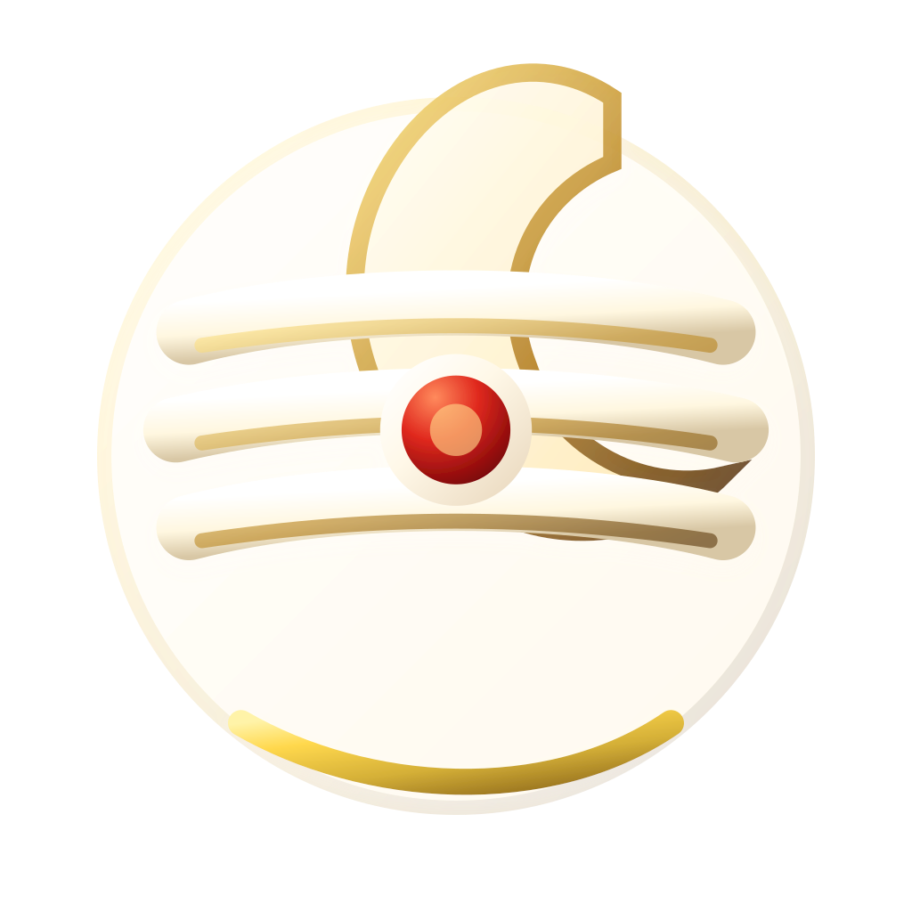 | `shiv-pooja.svg` | Shiv Pooja | redesign | Shiva lingam on its yoni base with three horizontal tripundra lines and a red bindu |
| 3 |  | `guardian-protector.svg` | Guardian Protector | redesign | trishul crossed with a small shield, protective guardian emblem |
| 4 | 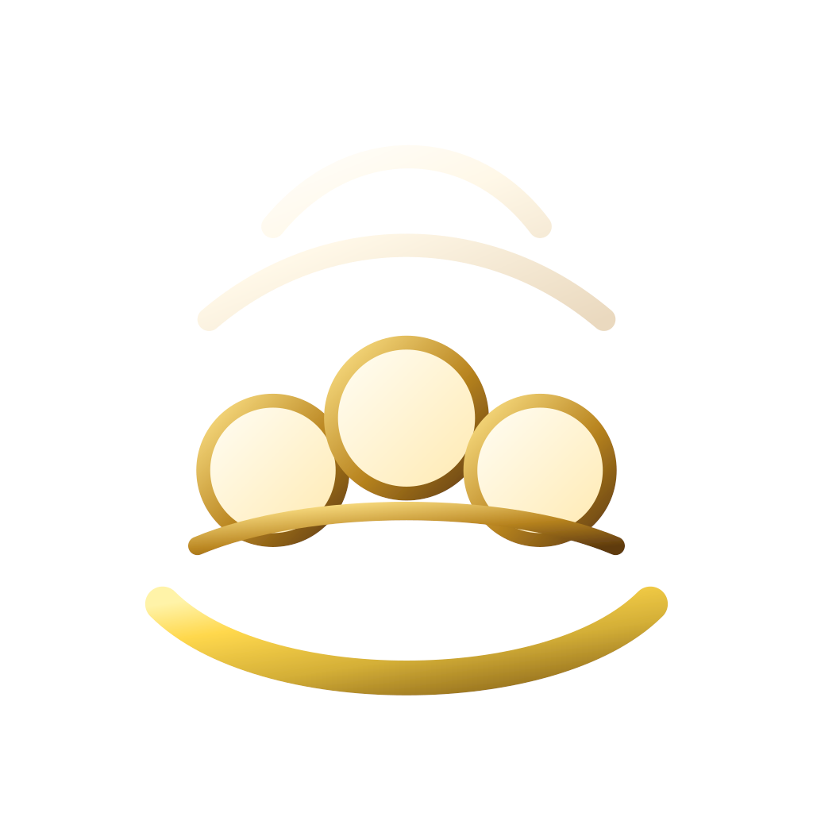 | `pitru-karya.svg` | Pitru Karya | redesign | three rice pinda balls on a leaf plate with a single kusha grass blade |
| 5 | 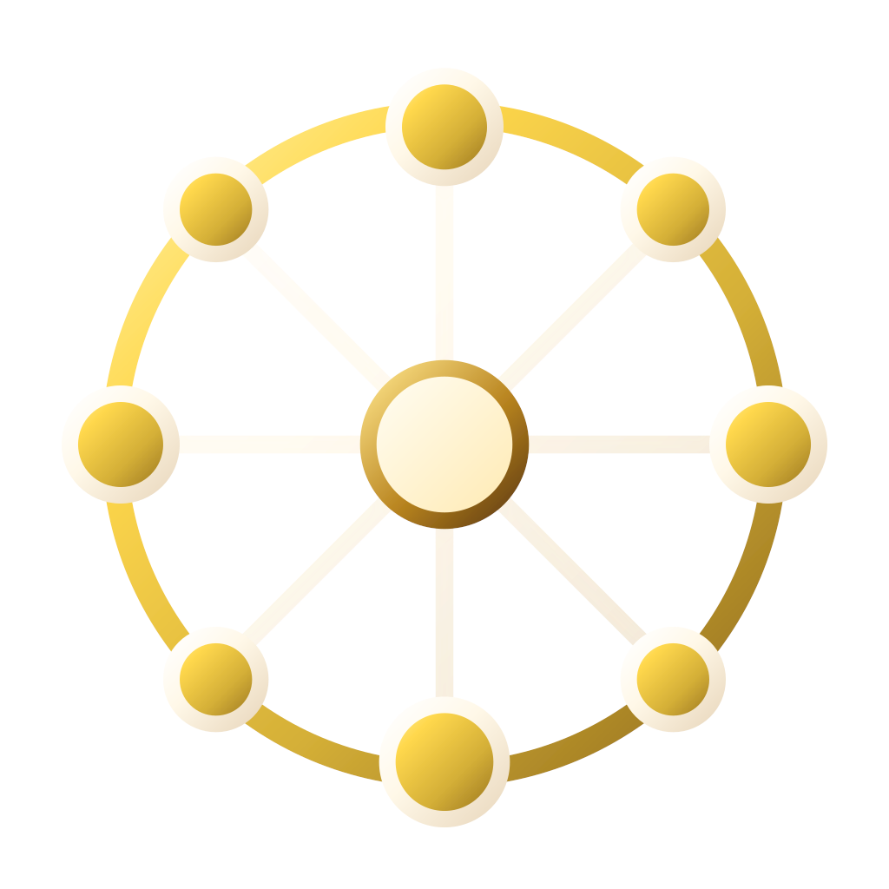 | `grah-shanti.svg` | Grah Shanti | redesign | central sun disc surrounded by a ring of nine small planet dots |
| 6 |  | `devi-pooja.svg` | Devi Pooja | redesign | lotus flower with a red bindu and a small crown/mukut outline above |
| 7 |  | `sanskar-life-events.svg` | Sanskar Life Events | redesign | sacred thread (janeu) loop crossing a small kalash |
| 8 |  | `ganga-kashi-rituals.svg` | Ganga Kashi Rituals | redesign | temple shikhara above three flowing river wave lines |
| 9 |  | `online-pooja-services.svg` | Online Pooja Services | redesign | smartphone outline with a small temple bell inside the screen |
| 10 | 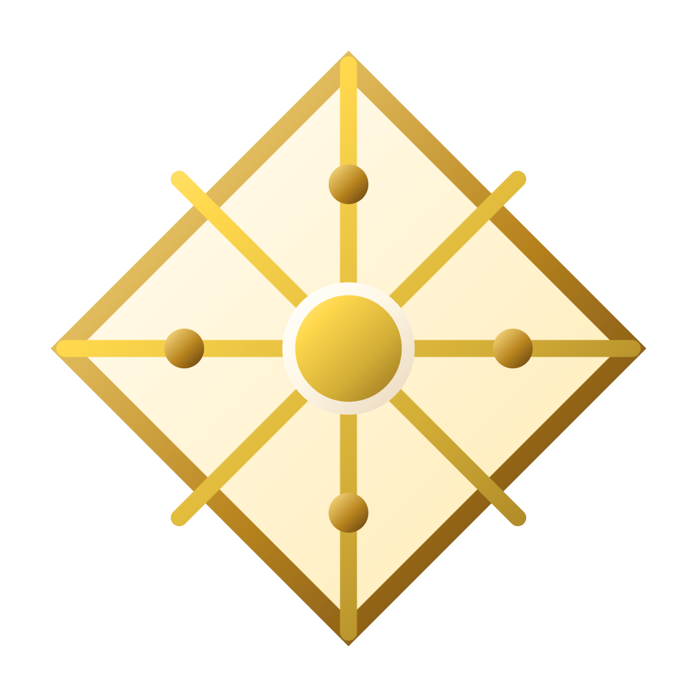 | `astrology-services.svg` | Astrology Services | redesign | circular zodiac wheel with twelve ticks and a central star |

## CTA, Contact & Support

| # | Prototype | File name | Name | Status | Draw this |
|---|---|---|---|---|---|
| 11 |  | `book-now.svg` | Book Now | redesign | calendar page with a bold check mark and a small lotus corner |
| 12 |  | `booking-token.svg` | Booking Token | redesign | ticket stub with a perforated edge and a small lotus mark |
| 13 |  | `phone-call.svg` | Phone Call | redesign | classic telephone handset with two small call waves |
| 14 |  | `whatsapp.svg` | WhatsApp | redesign | speech bubble with a handset inside (generic chat-call bubble, not the WhatsApp logo) |
| 15 |  | `chat-support.svg` | Chat Support | redesign | two overlapping speech bubbles with three dots |
| 16 |  | `talk-to-acharya.svg` | Talk To Acharya | redesign | speech bubble attached to a simple rudraksha mala bead loop |
| 17 |  | `acharya-guidance.svg` | Acharya Guidance | redesign | open palm (blessing gesture) holding a small lotus, no face |
| 18 |  | `email.svg` | Email | redesign | envelope with a folded flap and a tiny lotus seal |
| 19 |  | `location.svg` | Location | redesign | map pin with a small temple shikhara inside |
| 20 |  | `map-pin.svg` | Map Pin | redesign | plain map pin with a circular hole |
| 21 |  | `callback.svg` | Callback | redesign | handset with a circular return arrow |
| 22 |  | `video-call.svg` | Video Call | redesign | video camera body with a small play triangle lens |
| 23 |  | `headset-support.svg` | Headset Support | redesign | over-ear headset with microphone boom |
| 24 |  | `notification.svg` | Notification | redesign | temple bell with two small ring arcs |
| 25 |  | `broadcast-live.svg` | Broadcast Live | redesign | radiating broadcast arcs around a central dot |

## Booking, Commerce & Documents

| # | Prototype | File name | Name | Status | Draw this |
|---|---|---|---|---|---|
| 26 |  | `calendar-slot.svg` | Calendar Slot | redesign | calendar page with one highlighted square |
| 27 |  | `time-slot.svg` | Time Slot | redesign | clock face with hands at 10 and 2 and a small slot bar below |
| 28 | 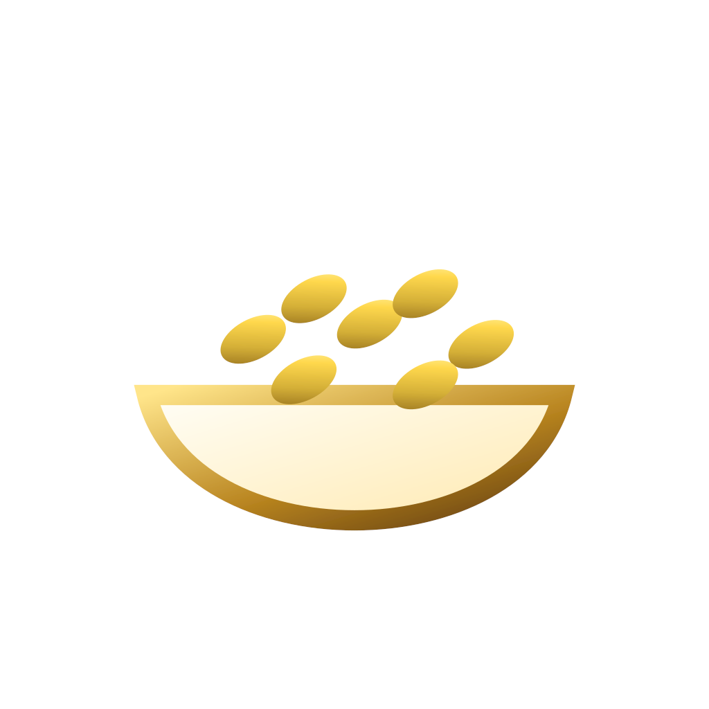 | `rupee-price.svg` | Rupee Price | redesign | Indian rupee symbol inside a coin circle |
| 29 |  | `price-range.svg` | Price Range | redesign | two rupee coins of different sizes with a small range bar |
| 30 |  | `payment.svg` | Payment | redesign | credit card with a chip and rupee symbol |
| 31 |  | `secure-payment.svg` | Secure Payment | redesign | credit card with a small padlock overlapping |
| 32 |  | `cart.svg` | Cart | redesign | shopping cart |
| 33 |  | `cart-add.svg` | Cart Add | redesign | shopping cart with a plus sign |
| 34 |  | `order-pending.svg` | Order Pending | redesign | package box with a small hourglass |
| 35 |  | `order-confirmed.svg` | Order Confirmed | redesign | package box with a check mark |
| 36 |  | `order-complete.svg` | Order Complete | redesign | package box with a ribbon seal and check |
| 37 |  | `reschedule.svg` | Reschedule | redesign | calendar page with a circular two-way arrow |
| 38 |  | `cancel-booking.svg` | Cancel Booking | redesign | calendar page with an X mark |
| 39 |  | `refund.svg` | Refund | redesign | rupee coin with a counter-clockwise return arrow |
| 40 |  | `receipt.svg` | Receipt | redesign | receipt slip with zigzag bottom and three lines |
| 41 |  | `invoice.svg` | Invoice | redesign | document page with a rupee symbol and lines |
| 42 |  | `certificate.svg` | Certificate | redesign | certificate sheet with a ribbon rosette seal |
| 43 |  | `download.svg` | Download | redesign | downward arrow into a tray |
| 44 |  | `document-pdf.svg` | Document PDF | redesign | document page with folded corner and a small badge strip |
| 45 |  | `package-compare.svg` | Package Compare | redesign | two package boxes side by side with a balance line |
| 46 |  | `materials-checklist.svg` | Materials Checklist | redesign | clipboard with three check rows |
| 47 |  | `prasad-delivery.svg` | Prasad Delivery | redesign | small sweets box (prasad) with a delivery motion line |
| 48 |  | `delivery-date.svg` | Delivery Date | redesign | delivery box with a small calendar tag |

## Core Pooja / Devata Service Stickers

| # | Prototype | File name | Name | Status | Draw this |
|---|---|---|---|---|---|
| 49 | 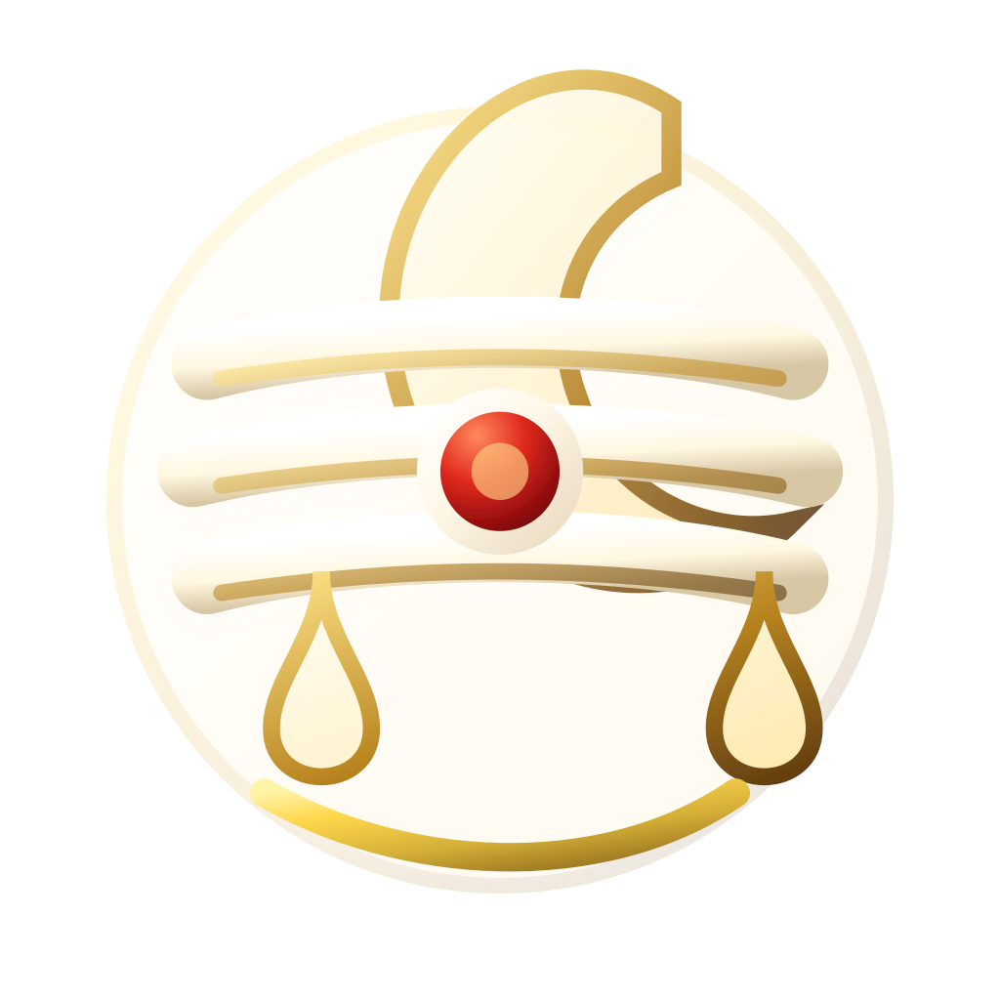 | `rudrabhishek.svg` | Rudrabhishek | redesign | Shiva lingam with a stream of milk/water pouring from a small kalash above |
| 50 | 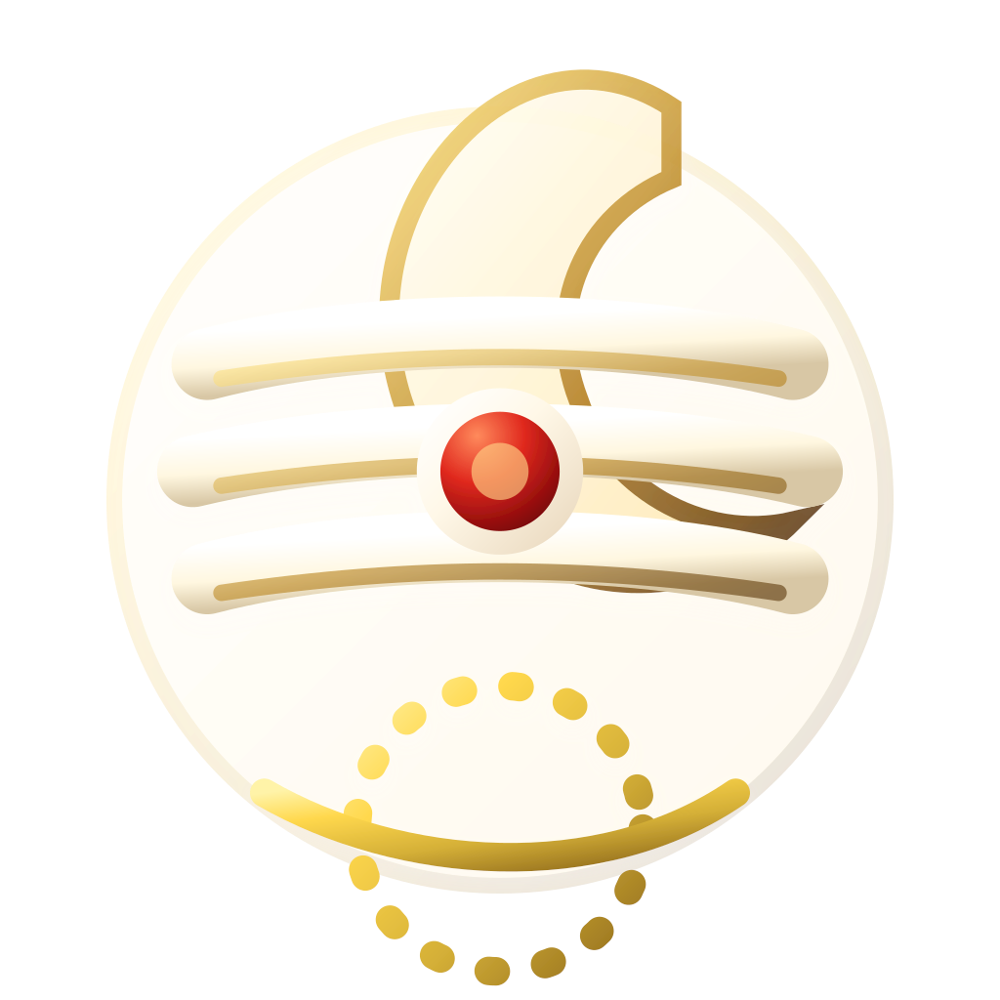 | `mahamrityunjay-jaap.svg` | Mahamrityunjay Jaap | redesign | Shiva third eye (vertical eye shape) above a rudraksha mala arc |
| 51 | 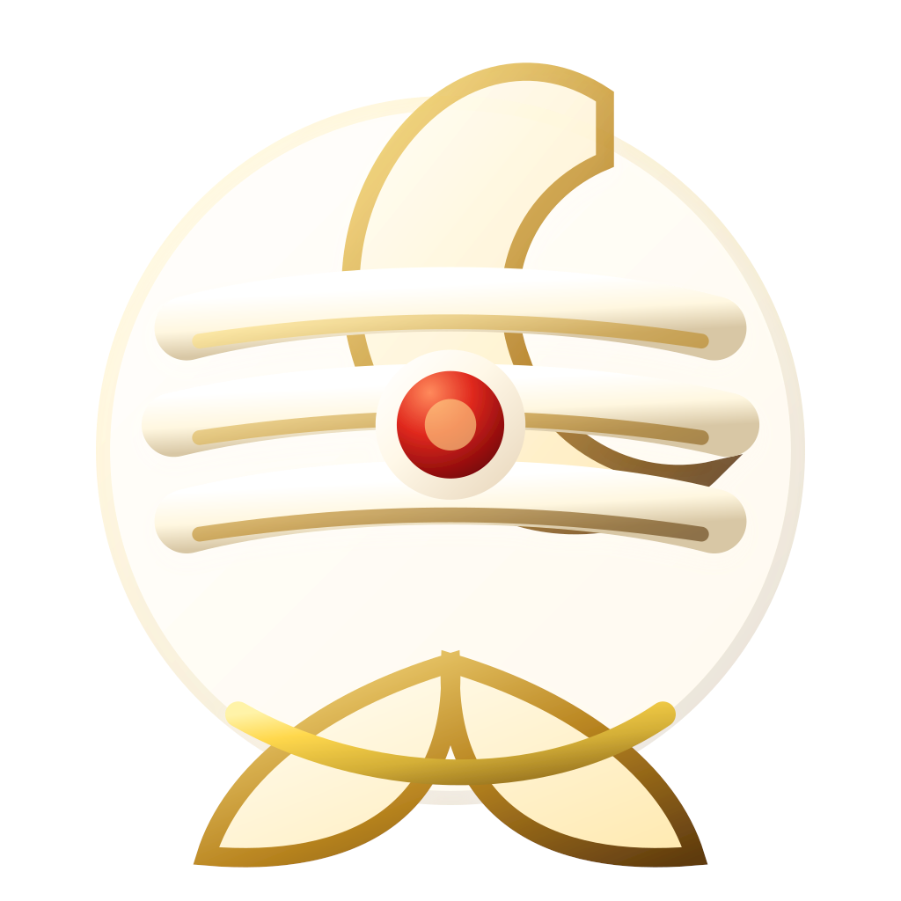 | `shivarchana.svg` | Shivarchana | redesign | Shiva lingam with three bel leaves (belpatra) offered on top |
| 52 | 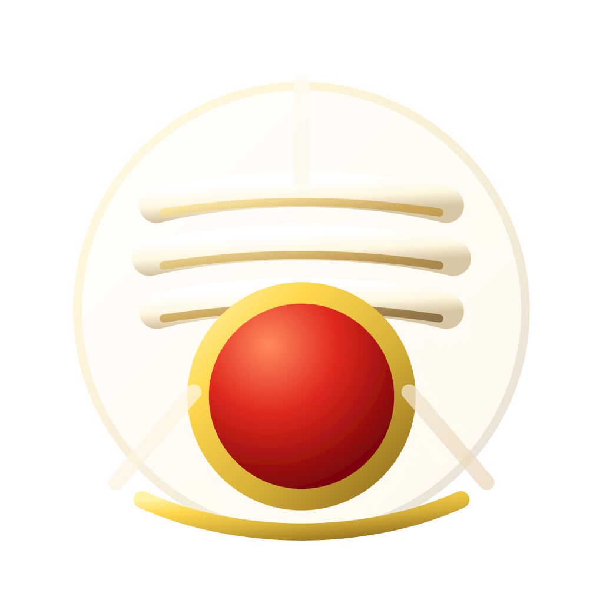 | `shiva-shakti-archana.svg` | Shiva Shakti Archana | redesign | trishul and lotus intertwined, symmetric |
| 53 | 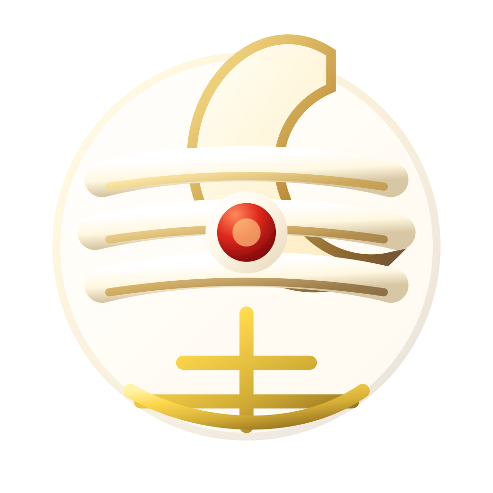 | `kashi-vishwanath-puja.svg` | Kashi Vishwanath Puja | redesign | golden temple shikhara with a small flag and a lingam at its base |
| 54 |  | `kashi-vishwanath-darshan.svg` | Kashi Vishwanath Darshan | redesign | golden temple shikhara with a small open eye / darshan arc above |
| 55 | 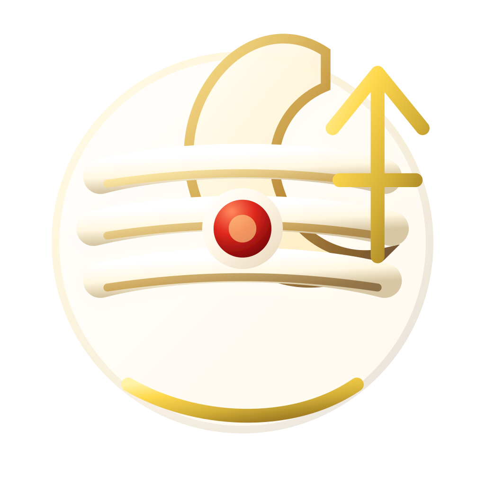 | `kaal-bhairav-puja.svg` | Kaal Bhairav Puja | redesign | trishul with a small damru tied to it and a guardian staff |
| 56 |  | `hanuman-puja.svg` | Hanuman Puja | redesign | gada (mace) upright with a small flag |
| 57 |  | `ganpati-puja.svg` | Ganpati Puja | redesign | modak on a plate with a durva grass sprig |
| 58 |  | `56-vinayaka-puja.svg` | 56 Vinayaka Puja | redesign | modak at centre surrounded by a ring of small dots (circle of shrines) |
| 59 |  | `vishnu-puja.svg` | Vishnu Puja | redesign | shankh (conch) and sudarshan chakra side by side |
| 60 |  | `narayana-puja.svg` | Narayana Puja | redesign | sudarshan chakra with a lotus below |
| 61 |  | `maa-annapurna-puja.svg` | Maa Annapurna Puja | redesign | bowl of rice with a ladle (kalchhi) across it |
| 62 |  | `devi-puja.svg` | Devi Puja | redesign | lotus with a red bindu and a small crescent |
| 63 |  | `shakti-puja.svg` | Shakti Puja | redesign | Sri Yantra style triangle geometry inside a circle |
| 64 |  | `chandi-path.svg` | Chandi Path | redesign | open scripture book with a small sword (khadga) above |
| 65 |  | `durga-saptashati.svg` | Durga Saptashati | redesign | open scripture book with a small trishul and lotus mark |
| 66 |  | `saraswati-puja.svg` | Saraswati Puja | redesign | veena instrument with a small lotus |

## Pitru, Shraddha & Moksha Services

| # | Prototype | File name | Name | Status | Draw this |
|---|---|---|---|---|---|
| 67 |  | `pind-daan.svg` | Pind Daan | redesign | three rice pinda balls on a leaf with water drops |
| 68 |  | `tripindi-shraddha.svg` | Tripindi Shraddha | redesign | three pinda balls in a triangle arrangement on a leaf |
| 69 |  | `shraddha-karma.svg` | Shraddha Karma | redesign | copper lota pouring water over kusha grass |
| 70 |  | `tarpan.svg` | Tarpan | redesign | cupped hands pouring water with sesame seeds (hands only, no face) |
| 71 |  | `thevasam.svg` | Thevasam | redesign | banana leaf plate with rice and a small lota |
| 72 |  | `narayana-bali.svg` | Narayana Bali | redesign | sudarshan chakra above three pinda balls |
| 73 |  | `naga-bali.svg` | Naga Bali | redesign | coiled serpent symbol around a small lingam |
| 74 |  | `pitri-dosh-nivaran.svg` | Pitri Dosh Nivaran | redesign | pinda ball with a protective circular arc |
| 75 |  | `asthi-visarjan.svg` | Asthi Visarjan | redesign | small urn (kalash) above river waves |
| 76 |  | `antyesti-sanskar.svg` | Antyesti Sanskar | redesign | funeral pyre logs with a small flame |
| 77 |  | `moksha-karya.svg` | Moksha Karya | redesign | lotus rising from river waves with an upward light ray |

## Grah Shanti & Jyotish

| # | Prototype | File name | Name | Status | Draw this |
|---|---|---|---|---|---|
| 78 |  | `navgrah-shanti.svg` | Navgrah Shanti | redesign | nine circles arranged in a 3x3 grid, central one larger |
| 79 |  | `kaal-sarp-dosh.svg` | Kaal Sarp Dosh | redesign | serpent forming a circle swallowing its tail around planet dots |
| 80 |  | `mangal-dosh.svg` | Mangal Dosh | redesign | Mars planet circle with a small triangle marker |
| 81 |  | `pitri-dosh.svg` | Pitri Dosh | redesign | pinda ball with a small planet ring |
| 82 |  | `vedic-astrology-consultation.svg` | Vedic Astrology Consultation | redesign | kundali chart square with a speech bubble |
| 83 |  | `kundali-booking.svg` | Kundali Booking | redesign | north-Indian diamond kundali chart with a check mark |
| 84 |  | `kundali-chart.svg` | Kundali Chart | redesign | north-Indian diamond kundali chart grid |
| 85 |  | `surya-graha.svg` | Surya Graha | redesign | sun disc with eight rays |
| 86 |  | `chandra-graha.svg` | Chandra Graha | redesign | crescent moon |
| 87 |  | `mangal-graha.svg` | Mangal Graha | redesign | planet circle with a small upward triangle (Mars) |
| 88 | 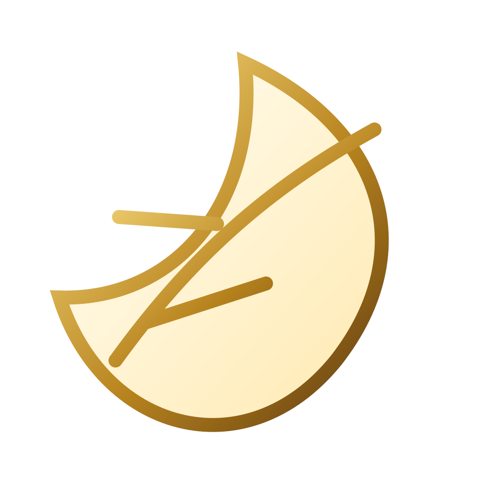 | `budh-graha.svg` | Budh Graha | redesign | planet circle with a small leaf (Mercury) |
| 89 |  | `guru-graha.svg` | Guru Graha | redesign | planet circle with a small book (Jupiter) |
| 90 |  | `shukra-graha.svg` | Shukra Graha | redesign | planet circle with a small star (Venus) |
| 91 |  | `shani-graha.svg` | Shani Graha | redesign | ringed planet (Saturn) |
| 92 | 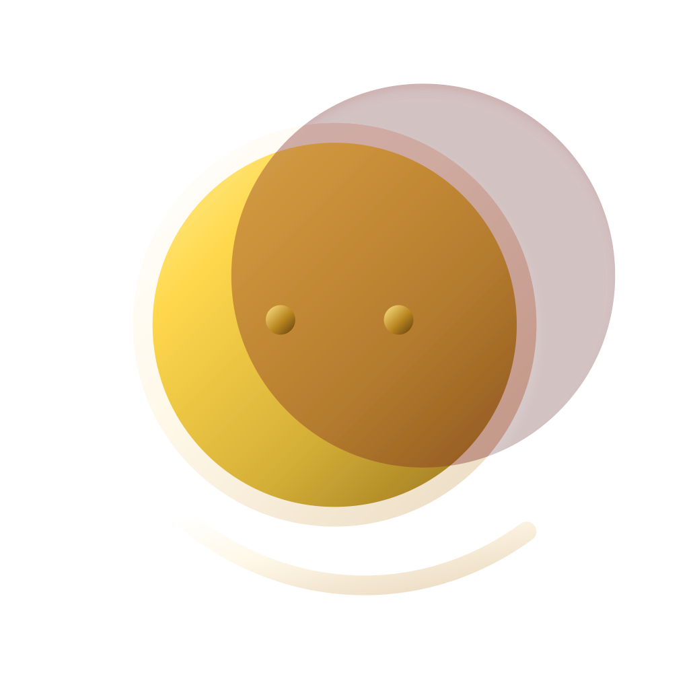 | `rahu-graha.svg` | Rahu Graha | redesign | half-dark eclipse disc with a serpent head silhouette |
| 93 |  | `ketu-graha.svg` | Ketu Graha | redesign | comet with a serpent tail |

## Ganga, Kashi Darshan & Tour

| # | Prototype | File name | Name | Status | Draw this |
|---|---|---|---|---|---|
| 94 |  | `ganga-aarti.svg` | Ganga Aarti | redesign | multi-tier aarti lamp (panch-aarti) with flames above river waves |
| 95 |  | `ganga-boat-ride.svg` | Ganga Boat Ride | redesign | wooden boat on river waves |
| 96 |  | `kashi-darshan-package.svg` | Kashi Darshan Package | redesign | temple shikhara with a suitcase tag |
| 97 |  | `vip-darshan.svg` | VIP Darshan | redesign | temple shikhara with a small crown badge |
| 98 |  | `temple-route.svg` | Temple Route | redesign | dotted route line ending at a temple |
| 99 | 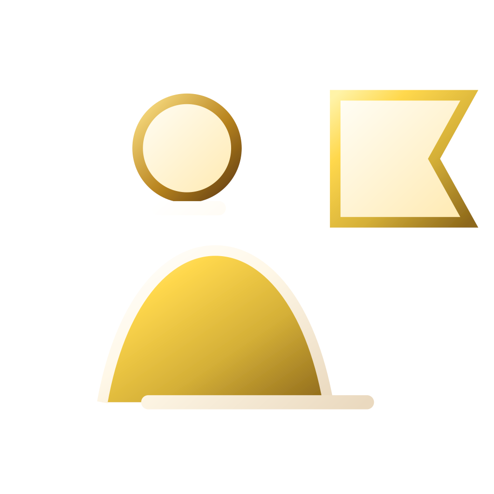 | `tour-guide.svg` | Tour Guide | redesign | flag on a pole with a small map |
| 100 |  | `itinerary.svg` | Itinerary | redesign | list page with a dotted route line |
| 101 |  | `boat-ride.svg` | Boat Ride | redesign | small boat with a single oar |
| 102 |  | `stay-in-varanasi.svg` | Stay In Varanasi | redesign | house outline with a small temple flag |
| 103 |  | `hotel-stay.svg` | Hotel Stay | redesign | bed outline |
| 104 |  | `transport.svg` | Transport | redesign | car front view |
| 105 |  | `ghat-visit.svg` | Ghat Visit | redesign | ghat steps descending into river waves |
| 106 |  | `kashi-ghat.svg` | Kashi Ghat | redesign | ghat steps with an umbrella (chhatri) at the top |
| 107 |  | `ganga-wave.svg` | Ganga Wave | redesign | three flowing river wave lines |

## Sanskar, Seva & Samagri

| # | Prototype | File name | Name | Status | Draw this |
|---|---|---|---|---|---|
| 108 |  | `vivaha-sanskar.svg` | Vivaha Sanskar | redesign | two linked rings above a small sacred fire kund |
| 109 |  | `special-occasion-puja.svg` | Special Occasion Puja | redesign | kalash with mango leaves and a small sparkle star |
| 110 |  | `auspicious-day.svg` | Auspicious Day | redesign | calendar page with a small lotus mark and sun |
| 111 | 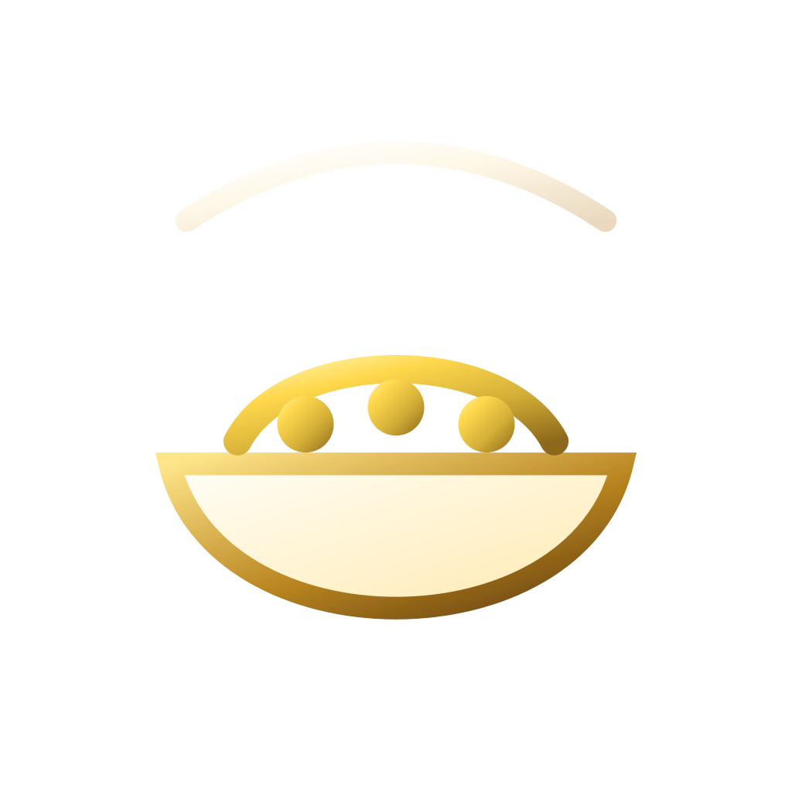 | `annadanam.svg` | Annadanam | redesign | plate of rice with a serving ladle and an offering hand |
| 112 |  | `brahmin-bhojan.svg` | Brahmin Bhojan | redesign | banana leaf meal plate with small food mounds |
| 113 |  | `gau-daan.svg` | Gau Daan | redesign | cow head symbol, simple and front facing, with a small garland |
| 114 |  | `gau-seva.svg` | Gau Seva | redesign | cow head symbol with a heart |
| 115 |  | `deep-daan.svg` | Deep Daan | redesign | single clay diya floating on river waves |
| 116 |  | `pooja-samagri.svg` | Pooja Samagri | redesign | puja plate with flowers, kalash and small bowls |
| 117 |  | `samagri-kit.svg` | Samagri Kit | redesign | box with a lotus mark and small items peeking out |
| 118 |  | `yagya-patra-panch-set.svg` | Yagya Patra Panch Set | redesign | five small ritual vessels in a row |
| 119 |  | `havan-kund.svg` | Havan Kund | redesign | square stepped havan kund with flames |
| 120 |  | `hawan-yagna.svg` | Hawan Yagna | redesign | havan kund with flames and a ladle pouring ghee |
| 121 |  | `ganpati-havan.svg` | Ganpati Havan | redesign | havan kund with a modak beside it |
| 122 |  | `kalash.svg` | Kalash | redesign | copper kalash with mango leaves and a coconut |
| 123 |  | `diya.svg` | Diya | redesign | single clay diya with a flame |
| 124 |  | `aarti-thali.svg` | Aarti Thali | redesign | round thali plate with a diya and flowers |
| 125 |  | `rudraksha-mala.svg` | Rudraksha Mala | redesign | rudraksha bead mala loop with a tassel |
| 126 |  | `belpatra.svg` | Belpatra | redesign | three-lobed bel leaf |
| 127 | 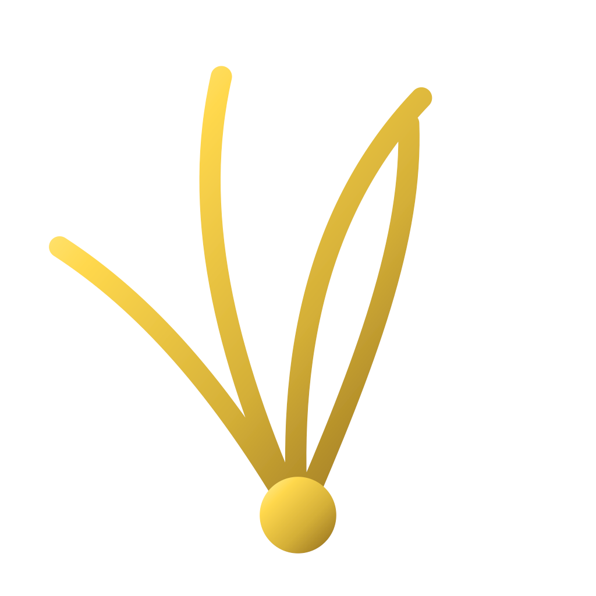 | `kusha-grass.svg` | Kusha Grass | redesign | bundle of kusha grass blades |
| 128 |  | `akshata-rice.svg` | Akshata Rice | redesign | small bowl of rice grains |
| 129 | 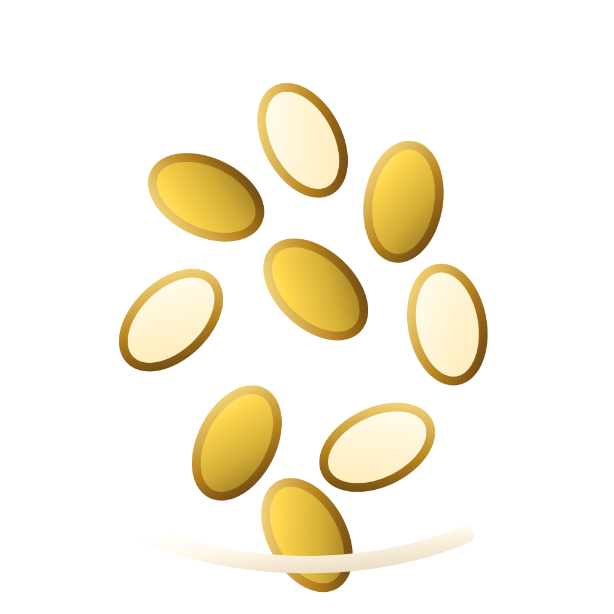 | `black-sesame.svg` | Black Sesame | redesign | small bowl of black sesame seeds |

## Service Page Section Icons

| # | Prototype | File name | Name | Status | Draw this |
|---|---|---|---|---|---|
| 130 |  | `what-is-this-ritual.svg` | What Is This Ritual | redesign | question mark inside a lotus circle |
| 131 |  | `why-perform-in-kashi.svg` | Why Perform In Kashi | redesign | temple shikhara with a small question mark |
| 132 |  | `who-should-perform.svg` | Who Should Perform | redesign | simple person outline (no face) with a check mark |
| 133 |  | `benefits.svg` | Benefits | redesign | upward sparkle star with a small plus |
| 134 |  | `blessing.svg` | Blessing | redesign | raised open palm (abhaya mudra) with a small lotus |
| 135 |  | `best-time-muhurat.svg` | Best Time Muhurat | redesign | sun dial / clock with a small sun |
| 136 |  | `duration.svg` | Duration | redesign | hourglass |
| 137 |  | `vidhi-steps.svg` | Vidhi Steps | redesign | numbered list of three steps |
| 138 |  | `ritual-steps.svg` | Ritual Steps | redesign | three ascending steps with a lotus at the top |
| 139 |  | `samagri-used.svg` | Samagri Used | redesign | puja plate with a small list |
| 140 |  | `location-venue.svg` | Location Venue | redesign | map pin with a temple |
| 141 |  | `packages.svg` | Packages | redesign | stacked boxes |
| 142 |  | `faq-help.svg` | FAQ Help | redesign | speech bubble with a question mark |
| 143 |  | `related-guides.svg` | Related Guides | redesign | two overlapping books |

## Trust, Media, Gallery & Content

| # | Prototype | File name | Name | Status | Draw this |
|---|---|---|---|---|---|
| 144 |  | `verified-pandit.svg` | Verified Pandit | redesign | badge rosette with a check mark |
| 145 |  | `certified-pandit.svg` | Certified Pandit | redesign | certificate ribbon seal with a small lotus |
| 146 |  | `experience.svg` | Experience | redesign | medal with a star |
| 147 |  | `secure.svg` | Secure | redesign | padlock |
| 148 |  | `shield-verified.svg` | Shield Verified | redesign | shield with a check mark |
| 149 |  | `transparent-pricing.svg` | Transparent Pricing | redesign | rupee symbol inside a clear price tag |
| 150 |  | `authentic-ritual.svg` | Authentic Ritual | redesign | lotus with a check mark |
| 151 |  | `trust-promise.svg` | Trust Promise | redesign | two hands shaking (hands only) |
| 152 |  | `rating.svg` | Rating | redesign | five-point star |
| 153 |  | `review.svg` | Review | redesign | speech bubble with a star |
| 154 |  | `testimonial.svg` | Testimonial | redesign | quotation marks inside a speech bubble |
| 155 |  | `gallery.svg` | Gallery | redesign | photo frame with mountain and sun |
| 156 |  | `camera.svg` | Camera | redesign | camera body |
| 157 |  | `video.svg` | Video | redesign | rounded video screen with a play triangle |
| 158 |  | `play.svg` | Play | redesign | play triangle inside a circle |
| 159 |  | `live-stream.svg` | Live Stream | redesign | play triangle with broadcast arcs |
| 160 |  | `video-proof.svg` | Video Proof | redesign | video screen with a check mark |
| 161 |  | `article.svg` | Article | redesign | document page with title bar and lines |
| 162 |  | `blog-guide.svg` | Blog Guide | redesign | open book with a bookmark ribbon |
| 163 |  | `book.svg` | Book | redesign | closed book |
| 164 |  | `reading-time.svg` | Reading Time | redesign | open book with a small clock |
| 165 |  | `festival-reminder.svg` | Festival Reminder | redesign | bell with a small calendar |
| 166 |  | `calendar-update.svg` | Calendar Update | redesign | calendar page with a refresh arrow |
| 167 |  | `community.svg` | Community | redesign | three simple person outlines (no faces) in an arc |
| 168 |  | `newsletter.svg` | Newsletter | redesign | envelope with a page coming out |
| 169 |  | `privacy.svg` | Privacy | redesign | shield with a keyhole |

## Sacred Symbols

| # | Prototype | File name | Name | Status | Draw this |
|---|---|---|---|---|---|
| 170 | — | `trishul.svg` | Trishul | new | upright trishul (trident) with a small damru knot at the shaft |
| 171 | — | `damru.svg` | Damru | new | hourglass-shaped damru drum with two cord beads |
| 172 | — | `shankh.svg` | Shankh | new | spiral conch shell, opening facing right |
| 173 | — | `lotus.svg` | Lotus | new | symmetric eight-petal lotus seen from the front |
| 174 | — | `om-symbol.svg` | Om | new | Om glyph drawn as clean geometric monoline (the only allowed glyph in the set) |
| 175 | — | `nandi.svg` | Nandi | new | seated Nandi bull silhouette in side profile, simplified, facing left |
| 176 | — | `tripundra-tilak.svg` | Tripundra Tilak | new | three horizontal ash lines with a red bindu in the centre |

## Samagri

| # | Prototype | File name | Name | Status | Draw this |
|---|---|---|---|---|---|
| 177 | — | `kamandal.svg` | Kamandal | new | round kamandal water pot with a curved handle and spout |
| 178 | — | `ghanta-bell.svg` | Puja Ghanta | new | hand-held puja bell with a small handle on top |
| 179 | — | `chandan.svg` | Chandan | new | small bowl of sandalwood paste with a stick resting on it |
| 180 | — | `pushpa-mala.svg` | Pushpa Mala | new | marigold flower garland forming a U loop |
| 181 | — | `dhoop-agarbatti.svg` | Dhoop Agarbatti | new | two incense sticks in a stand with a thin curling smoke line |
| 182 | — | `shriphal-coconut.svg` | Shriphal | new | coconut with a red-thread kalava tied around it |
| 183 | — | `panchamrit.svg` | Panchamrit | new | small bowl with five dots representing the five nectars |
| 184 | — | `ganga-jal.svg` | Ganga Jal | new | small copper lota with a water drop and two wave lines |

## Sacred Symbols

| # | Prototype | File name | Name | Status | Draw this |
|---|---|---|---|---|---|
| 185 | — | `yantra.svg` | Yantra | new | square yantra with a central triangle and lotus border |

## Core Pooja

| # | Prototype | File name | Name | Status | Draw this |
|---|---|---|---|---|---|
| 186 | — | `mantra-jaap.svg` | Mantra Jaap | new | rudraksha mala held in a circle around a small sound-wave arc |
| 187 | — | `katha-path.svg` | Katha Path | new | open scripture book on a wooden stand (vyas peeth) |
| 188 | — | `satyanarayan-katha.svg` | Satyanarayan Katha | new | banana-leaf pillars framing a small kalash and book |

## Sanskar

| # | Prototype | File name | Name | Status | Draw this |
|---|---|---|---|---|---|
| 189 | — | `griha-pravesh.svg` | Griha Pravesh | new | house outline with a kalash at the door |
| 190 | — | `mundan-sanskar.svg` | Mundan Sanskar | new | small tuft of hair (shikha) above a kalash |
| 191 | — | `namkaran-sanskar.svg` | Namkaran Sanskar | new | small cradle with a star above |
| 192 | — | `upanayan-janeu.svg` | Upanayan / Janeu | new | sacred thread loop with three knots |

## Core Pooja

| # | Prototype | File name | Name | Status | Draw this |
|---|---|---|---|---|---|
| 193 | — | `rudri-path.svg` | Rudri Path | new | open scripture book with a Shiva lingam mark on the page |

## Festivals

| # | Prototype | File name | Name | Status | Draw this |
|---|---|---|---|---|---|
| 194 | — | `maha-shivratri.svg` | Maha Shivratri | new | Shiva lingam under a crescent moon and night stars |
| 195 | — | `sawan-somvar.svg` | Sawan Somvar | new | Shiva lingam with rain drops falling |
| 196 | — | `dev-deepawali.svg` | Dev Deepawali | new | row of five diyas on ghat steps above river waves |
| 197 | — | `navratri.svg` | Navratri | new | kalash with nine small dots arranged in an arc above it |
| 198 | — | `pitru-paksha.svg` | Pitru Paksha | new | pinda ball on a leaf under a waning crescent moon |

## Booking

| # | Prototype | File name | Name | Status | Draw this |
|---|---|---|---|---|---|
| 199 | — | `group-booking.svg` | Group Booking | new | three simple person outlines (no faces) with a calendar tag |
| 200 | — | `nri-online-booking.svg` | NRI Online Booking | new | globe with a small temple pin on it |
